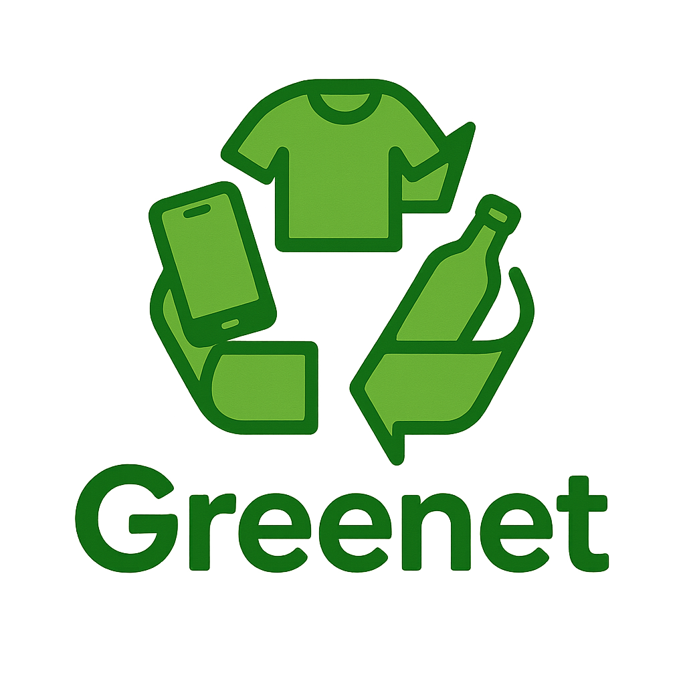

  

---

# Greenet ♻️
**Plataforma de Intercambio y Reciclaje Comunitario** 

---

## 🌍 Descripción del Proyecto 
**Greenet** es una aplicación digital que impulsa el **intercambio, reuso y reciclaje de recursos** dentro de comunidades locales.  

El objetivo es:  
- Reducir el consumo innecesario.  
- Fomentar prácticas sostenibles.  
- Fortalecer la colaboración comunitaria.  

Además, contribuye directamente al **ODS 11: Ciudades y comunidades sostenibles**✨

---

## 🚀 Funcionalidades Principales  

📍 **Mapa de Puntos Verdes**  
- Ubicación de centros de reciclaje y recolección.  
- Identificación de zonas comunitarias para intercambio.  

🔔 **Sistema de Notificaciones**  
- Alertas en tiempo real sobre coincidencias de intercambio.  
- Recordatorios de reciclaje y sostenibilidad.  

💬 **Comunidad y Colaboración**  
- Foros de discusión y valoración de usuarios.  
- Consejos prácticos sobre economía circular.  

♻️ **Gestión de Intercambios**  
- Registro de objetos ofrecidos y solicitados.  
- Match automático entre usuarios con intereses comunes.  

📚 **Tips y Buenas Prácticas**  
- Guía sobre separación y reutilización de materiales.  
- Recomendaciones para reducir el impacto ambiental.

---

📲 APK (próximamente)

---

## 🛠️ Tecnologías y Herramientas
- Lenguaje: Javafx, SQL
- Base de datos: PostgreSQL
 
---

## 👥 Equipo de Desarrollo

Mateo Zamora,https://github.com/mate1821

Samuel Rey,https://github.com/S4muelRey06
 
Brandon Garcia, https://github.com/brangarcor05

Andres Beltran,https://github.com/pipe2409

Eileen Rodriguez,https://github.com/Eileexxn
